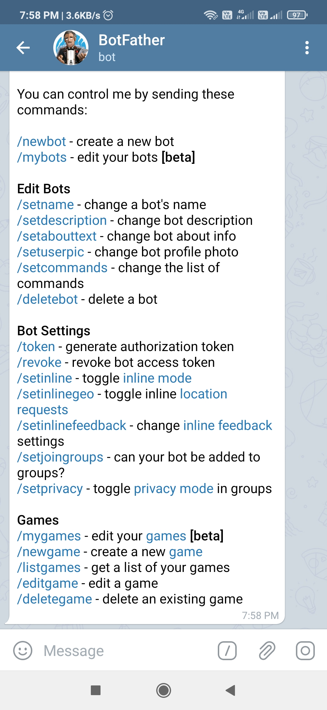
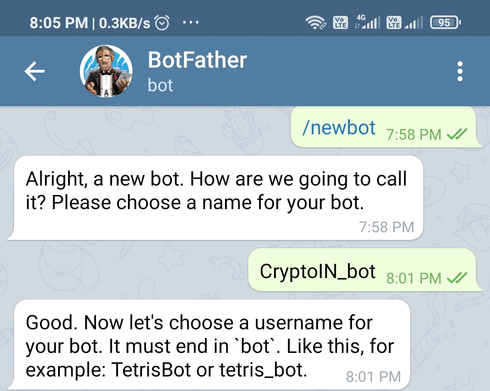
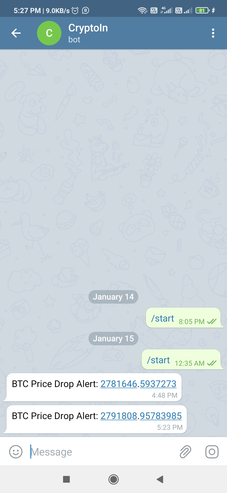

# CryptoIN Telegram Bot
CryptoIN Bot Notify us latest price of Cryptocurrency 

## We use [Coinbase API](https://developers.coinbase.com/api/v2) to get data of CRYPTOCURRENCY

### TO Create Telegram Bot we use Bot father 
 
 
 ### Create Bot
 
 
 
  ## Get your Bot ID From Telegram bot -> IDBot
  
  # Output
  
 
 
 
 # Code by [Priyanshu](https://www.linkedin.com/in/priyanshuofficial/)
